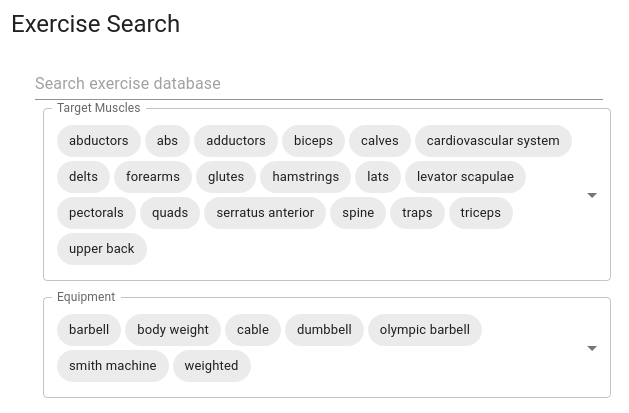
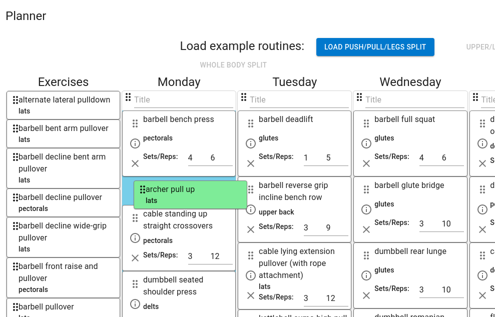
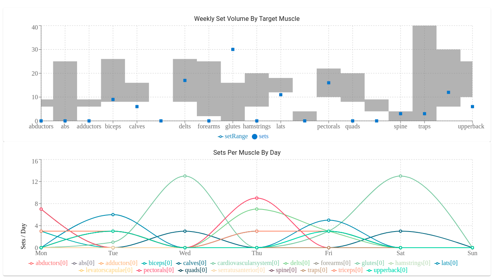

# Workout Split Planner
Optimize and visualize your weekly set volume by finding the perfect exercise for every muscle group with the equipment you have on hand.

[exercise-planner.vercel.app](exercise-planner.vercel.app)

## Running the app

Install packages
### `npm install`

Start on local dev server (localhost:3000)
### `npm start`

## How it works

The Workout Split Planner is a client-side app created with React using the `@mui/material`, `react-beautiful-dnd`, and `recharts` frameworks.

Upon loading the site first constructs an object consisting of all 1300 exercises and their repsective details on target muscles, required equipment, and demonstration gif URLs from the ExerciseDB API. 

This object filtered upon by the user's search query, and stored on a smaller object that is displayed as a list of items in the first column of the `react-beautiful-dnd` 'DragDropContext' component. These individual items can then be dragged between columns with editable set and rep counts.

States are utilized to prepare and aggregate the sets for each exercise, feeding them to the analysis section that will populate `recharts` bar and line graphs for Weekly Set Volume By Target Muscle and Sets Per Muscle By Day visualizations respectively.

## How to use

The Workout Split Planner is designed for visualizing day-to-day set volume, sorted by muscle group.

Exercises can be shown in the results column by querying in the search field, and filtered by target muscle or required equipment. The exercise cards can be added to the seven columns by dragging and dropping them accordingly. The sets and reps can be configured for each exercise. More information can be found about the exercise by clicking on the information icon on the card.

Each column can be titled (such as 'Push', 'Pull', 'Legs') and can also be dragged to swap entire daily routines around your schedule.

The analysis section will graph your sets per day per target muscle. Recalculating this visualization can be done by clicking the 'Refresh Analysis' button.

## Known warnings / bugs
- Warning: React does not recognize the `isDragging` prop on a DOM element. - react-beautiful-dnd issue
- Warning: div cannot appear and descendant of p - Material UI quirk
https://stackoverflow.com/questions/41928567/div-cannot-appear-as-a-descendant-of-p

## Feature list

- Scrollable DragDropContext for mobile use
- 'Info' access on cards in search section, can currently only access exercise information after placing in routine
- Custom chart building
- Routine saving/uploading to state
- Custom exercise creator/uploading functionality
